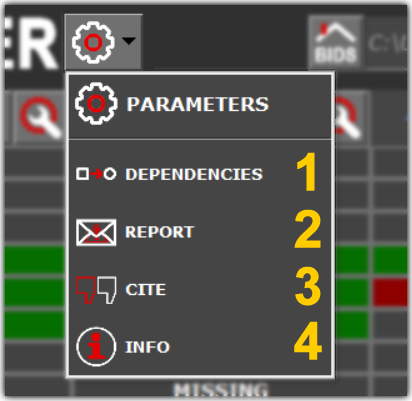
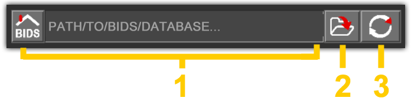
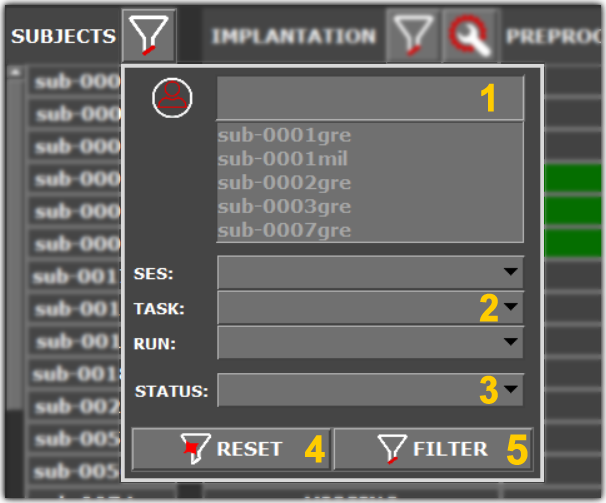
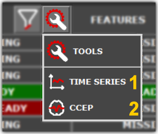
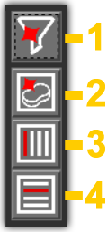
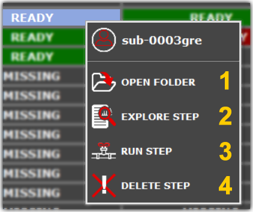
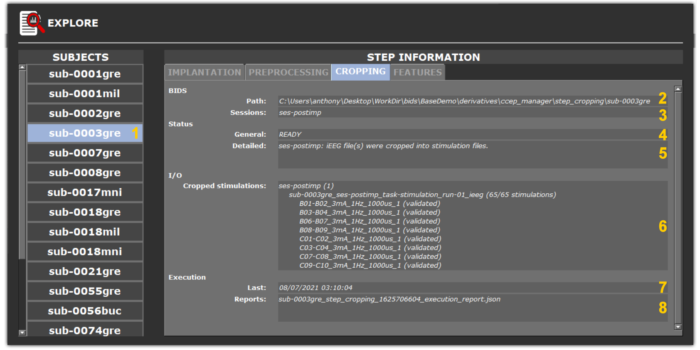
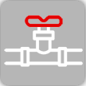
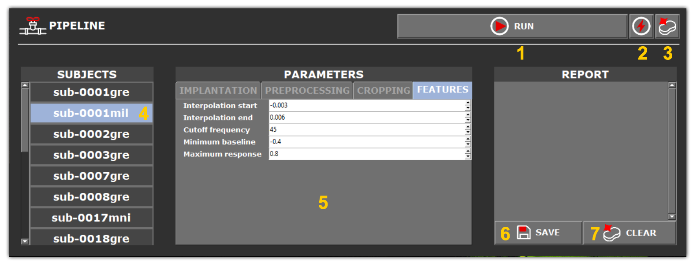

.. _Main UI:

User interface
**************

CCEP Manager interface primarly consists of an :ref:`interactive table<panels UI>`, which shows for each patient the status of each step
forming the processing pipeline. Cells are selectable and a number of contextual actions can be performed on the active selection,
such as :ref:`processing the data <Process UI>`, viewing detailed :ref:`step information 
`,
or exploring results using :ref:`dedicated tools <tools>`.

.. _panels UI:

.. figure:: /art/cpman_main_ui.png
	:width: 1000px
	
| 		**1 - App management**: Administer the application.
| 		**2 - BIDS management**: Select/refresh the active BIDS database.
| 		**3 - Pipeline Management**: Interactive table to process and explore data.

Parameters
==========

Application parameters are accessible by clicking |parameters button|.

	
.. _parameters UI:

	
| 		**1 - Dependencies**: Specify the paths to external softwares.
| 		**2 - Report**: Send a bug report.
| 		**3 - Cite**: Authoring information and references.
|		**4 - Info**: Licensing information.	

BIDS database
=============

The active BIDS database is specified by clicking |open button| and then selecting 
the root directory of the appropriate BIDS database.

.. _BIDS UI:

|		**1 - Home**: Path to the active BIDS database.
|		**2 - Browse**: Specify the active BIDS database.
|		**3 - Refresh**: Refresh the :ref:`interactive table<panels UI>`.	

Filters
=======

It is possible to filter the :ref:`interactive table<panels UI>` by clicking |filter button| at the top of the subject list.

	
.. _filter UI:

|		**1 - Name**: Filter the table by subject name.
|		**2 - BIDS**: Filter the table using BIDS entities.
|		**3 - Status**: Filter the table depdending on step status.	
|		**4 - Reset**: Reset filters.	
|		**5 - Apply**: Apply filters.

It is also possible to filter processing steps depending on their status clicking the |filter button| buttons accessible on top
of each column of the :ref:`interactive table<panels UI>`.  	

Tools
=====

Each step produces substantially different outputs which can be explored using :ref:`tools<tools>` accessible 
by clicking |wrench button|. The tools available differ depending on the processing step. 

	
.. _wrench UI:

	
|		**1 - Time series**: :ref:`Visualize time series with AnyWave<time series visualization>`.
|		**2 - CCEP**: :ref:`Visualize CCEP in 3D with HiBoP<CCEP visualization>`.
|		**3 - Features (not shown)**: :ref:`Extract CCEP features in text files<feature tables>`.

Toolbar
=======

The toolbar is used to quickly (un)-select cells from the :ref:`interactive table<panels UI>` and reset filters.

.. _toolbar UI:

	
|		**1 - Reset flters**: Reset all filters.
|		**2 - Clear selection**: Clear the active selection.
|		**3 - Vertical selection**: Toggle vertical selection mode.
|		**4 - Horizontal selection**: Toggle horizontal selection mode.

Contextual actions
==================

Cells from the :ref:`interactive table<ui table>` are selectable and a number of contextual actions are accessible after right clicking
the active selection.

.. _contextual UI:

	
|		**1 - Open**: Open the step directory in the file browser.
|		**2 - Explore**: :ref:`View detailed step information
`.
|		**3 - Run**: :ref:`Process the step<Process UI>`.
|		**4 - Delete**: Delete all data related to the step.

.. _Details UI:

Explore
-------

The *EXPLORE* option (|explore button|) is used to display more in depth information regarding the status of processing steps.
The subjects and steps appearing depend on the selection made in the :ref:`interactive table <Panels UI>`.

	
.. _Details UI figure:

	
|	**1 - Subject list**: List of selectable subjects.
|	**2 - Path**: Path to the step directory.
|	**3 - Sessions**: Processed BIDS session(s).
|	**4 - General status**: General status of the step.
|	**5 - Detailed status**: Detailed status of the step. Session-wise status.
|	**6 - Inputs/ouputs**: step dependent input/output files.
|		*IMPLANTATION*: :ref:`List of implantation files with matching status<implantation step>`.
|		*PREPROCESSING*: :ref:`List of iEEG files with preprocessing status<preprocessing step>`.
|		*CROPPING*: List of :ref:`cropped stimulation files<cropping step>` with :ref:`quality control status<quality control>`.
|		*FEATURES*: :ref:`List of cropped stimulations files with features extraction status<features step>`.
|	**7 - Last**: Date of the last execution.
|	**8 - Reports**: List of execution reports.

.. _Process UI:

Run
---

The *RUN* option (|pipeline button|) is used to configure and execute processing steps. 
The subjects and steps appearing depend on the selection made in the :ref:`interactive table <Panels UI>`.
The description of the processing steps and associated parameters can be found in the :ref:`dedicated chapter <processing data>`. 

	
.. _Process UI figure:

	
|	**1 - Run**: Start processing data.
|	**2 - Force**: Toggle to bypass checkups before execution.
|	**3 - Clean**: Toggle to delete the output folder before execution.
|	**4 - Subject list**: List of selectable subjects.
|	**5 - Step parameters**: Tabs to configure the steps for the active subject.
|		*IMPLANTATIION*: :ref:`Implantation step parameters<implantation step>`.
|		*PREPROCESSING*: :ref:`Preprocessing step parameters<preprocessing step>`.
|		*CROPPING*: :ref:`Cropping step parameters<cropping step>`.
|		*FEATURES*: :ref:`Features step parameters<features step>`.
|	**6 - Clear**: Clear the console.
|	**7 - Save**: Save the console in a text file.

