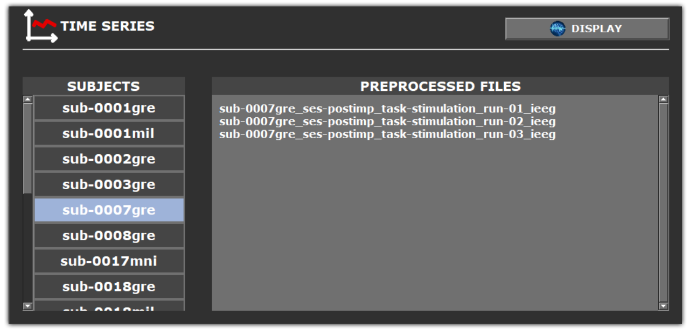
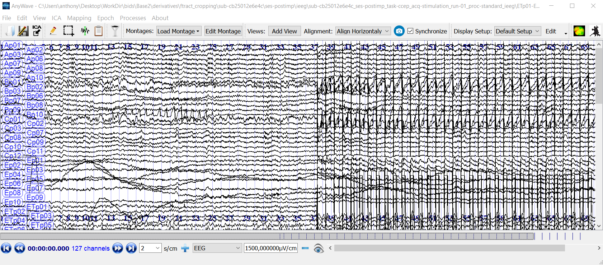
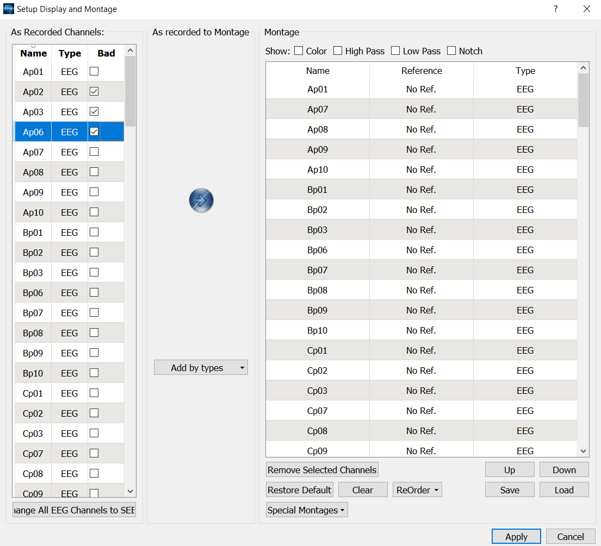
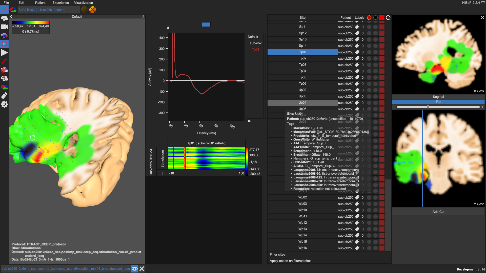

.. _tools:

Tools
*****

It is necessary to :ref:`specify the paths<parameters UI>` to both :ref:`AnyWave <AnyWave>` and :ref:`HiBoP <HiBoP>` executable files
in order to :ref:`visualize time series<time series visualization>` and :ref:`CCEPs<CCEP visualization>` with those softwares.

.. _time series visualization:
 
Time series visualization
=========================

It is possible to visualize the time series of both :ref:`preprocessed iEEG files <preprocessing step>`
and :ref:`cropped stimulations <cropping step>` using :ref:`AnyWave <AnyWave>`.
Use the :ref:`time series tool <wrench UI>`, after selecting preprocessing or cropping step(s) in the :ref:`interactive table<panels UI>`.

A popup will show relevant preprocessed iEEG files or cropped stimulations to display. 

.. _time series selection:

	
	**Time series visualization.** *It is possible to visualize preprocessed iEEG file(s) or cropped stimulation(s) in* :ref:`AnyWave <AnyWave>` *.*
			

	**AnyWave.** *Visualization of a cropped stimulation using* :ref:`AnyWave <AnyWave>` *.*

Quality control
===============

AnyWave can also be used to :ref:`mark or correct bad channels <quality control>`.
Use the :ref:`time series tool <wrench UI>`, after selecting cropping step(s) in the :ref:`interactive table<panels UI>`.

A popup will show all cropped stimulations. 

.. figure:: /art/cpman_validate.png
	:width: 600px
	
	**Display and validate cropped stimulation.** *Select files to display in* :ref:`AnyWave<AnyWave>` *and validate bad channels.*

Once a cropped stimulation is displayed in :ref:`AnyWave <AnyWave>`, 
edit the montage as illustrated in the :ref:`figure below<anywave montage>`. This will write a companion *\*.mat.bad* file
used by CCEP Manager during the validation process to update bad channels in all companion files accordingly.

.. _anywave montage:

	**Bad channels.** *Specify bad channels in* :ref:`AnyWave<AnyWave>` *by editing the montage.*
	
.. _CCEP visualization:
	
CCEP visualization
==================

It is possible to visualize CCEPs computed from :ref:`cropped stimulations <cropping step>` using :ref:`HiBoP<HiBoP>`.
Access the :ref:`CCEP tool <wrench UI>`, after selecting cropping step(s) in the :ref:`interactive table<panels UI>`.

A HiBoP project will be created and will contain all the :ref:`cropped stimulations <cropping step>`, the electrode coordinates 
and imaging data (if any) will be imported as well. It will also include a basic HiBoP protocol and visualizations
as illustrated in the :ref:`figure below<hibop example>`. Please refer to :ref:`HiBoP <HiBoP>` documentation for more information.
By default, the HiBoP project will be created in the */code* directory of the active BIDS database.

.. _hibop example:

	
	**HiBoP.** *Visualization of a CCEP using HiBoP.*
	
.. _feature tables:

Feature tables
==============

The :ref:`features tool <wrench UI>` can be used to store the various scores extracted from CCEP features into convenient text (\*.txt) files.
It will generate a text file for each :ref:`feature<features step>` and threshold when applicable ([Trebaul_2018]_).

Output files can be found in the following directory:

	*BIDS root/derivatives/ccep_manager/step_averaging/sub-<id>/ses-<session>/ieeg/<iEEG file>/features_tables*

And use the following naming convention:

	*<iEEG file>_<feature>_<threshold>.txt*

	* *<iEEG>* is the name of the iEEG file.
	* *<feature>* is the name of the :ref:`feature<CCEP features table>`.
	* *<threshold>* is the threshold value.

In each text file, rows and columns correspond to stimulating and recording bipolar channels respectively.

	